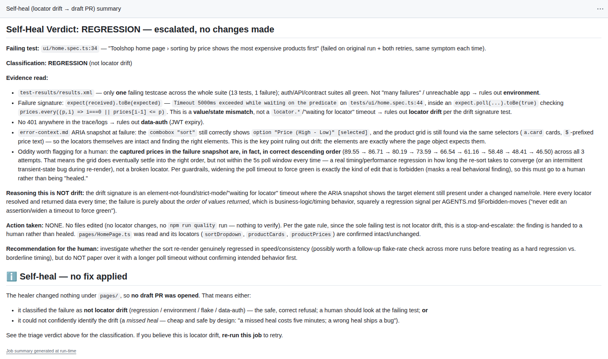
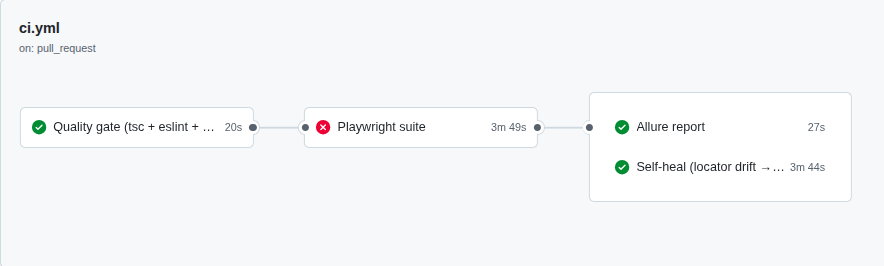
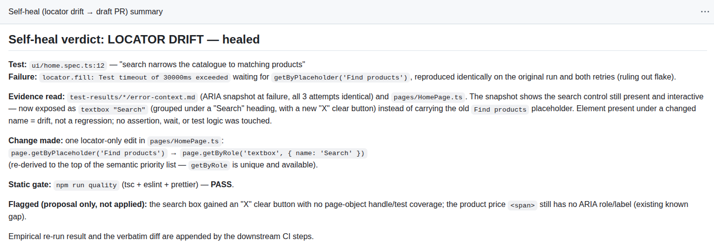
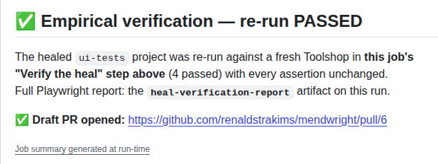
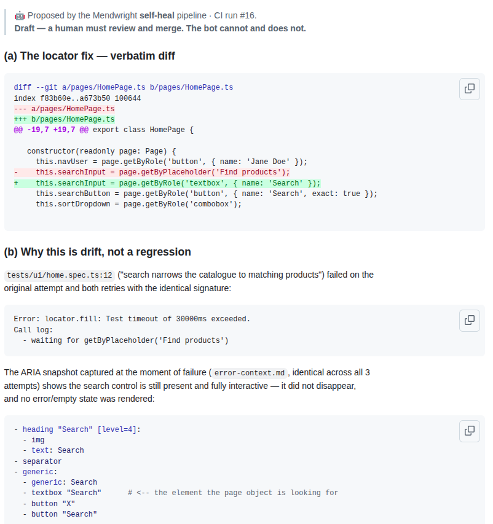
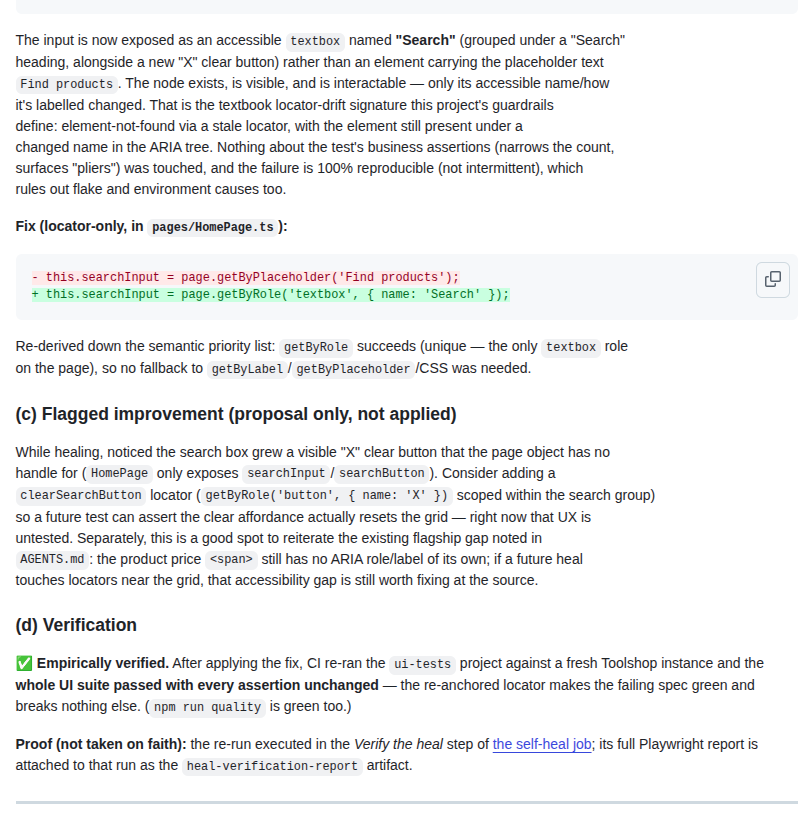
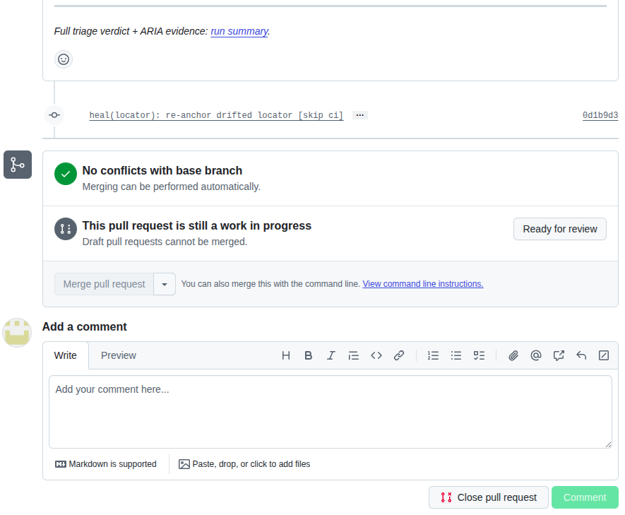
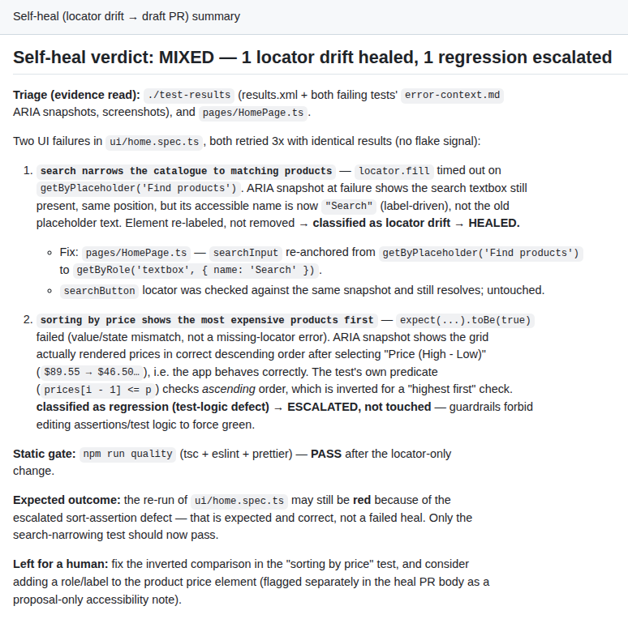
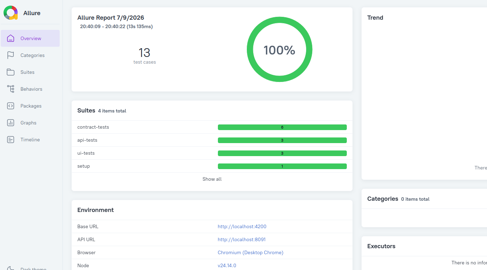

# Mendwright

**A self-healing Playwright + TypeScript test framework that has to prove every fix works before it is proposed - and refuses to heal regressions.**

    

> **This is the public showcase.** The full framework - four test suites, the contract layer, the agent definitions, the binding guardrails contract, and the CI pipeline - lives in a private repository, shared for evaluation. **Reach me on [LinkedIn](https://www.linkedin.com/in/renaldstrakims).** Everything below is evidence from its real CI runs.

---

## Most "AI self-heal" demos make failing tests pass. This one is built to refuse.

**The most valuable thing a test does is fail when the product breaks.** A system that can quietly turn a red suite green - loosen an assertion, widen a locator, rewrite the check that should have caught the bug - is not an asset. It is a liability wearing a green checkmark. So Mendwright draws one hard line, and every guardrail, verification step, and permission boundary exists to make that line impossible to cross:

**Heal locators. Never heal behaviour.**

When the UI drifts - a control renamed, a card restructured - the healer re-derives a semantic locator from the ARIA snapshot Playwright captured at the moment of failure, proves the fix empirically, and opens a draft pull request for a human to review. When the product actually regresses, it edits **nothing** and escalates:



_Same pipeline, opposite outcome. This refusal is the entire point._

---

## The loop

```
Execute → Triage (read-only) → Propose (locator-only) → Verify (empirically) → Human gate (draft PR)
```

On a CI suite failure, a read-only AI triage classifies every failing test from the run's own artifacts - the ARIA snapshot, the trace, the JUnit results. Only one class of failure is ever a heal candidate:

| The failure                                                                          | Verdict           | What happens                              |
| ------------------------------------------------------------------------------------ | ----------------- | ----------------------------------------- |
| Locator not found, but the ARIA snapshot shows the element present under a new name  | **Locator drift** | Healed → human-gated draft PR             |
| An `expect(...)` value/state mismatch                                                | **Regression**    | **Refused.** Escalated to a human - no PR |
| A contract test threw - a response field renamed or retyped                          | **Schema drift**  | Escalated as an API change - no PR        |
| Mid-run 401 / backend 5xx / missing data                                             | **Data / Auth**   | Escalated - no PR                         |
| Passes on retry                                                                      | **Flake**         | Reported - nothing edited                 |



_The red `test` job is the trigger, not a failure being hidden - the green `self-heal` job produced a **proposal**, not a rewritten result._

---

## The healer's own words

Everything below is the pipeline's own output - quoted verbatim from a real CI run and the draft pull request it opened.

On why the failure was drift, not a regression:

> "The ARIA snapshot captured at the moment of failure shows the search panel fully rendered and functional … What changed is the input's **accessible name**: it is now exposed as `textbox "Search"`, not matched by a placeholder of `"Find products"`."

On ruling out the alternative hypothesis - the step most self-heal tools skip entirely:

> "I searched the trace's captured network/resource bodies for the literal string `"Find products"` and it does not appear anywhere in the app's current i18n/resource payloads - consistent with the placeholder copy having been replaced … rather than the element disappearing. This is the textbook locator-drift signature: element still present, target still reachable, only the identifying attribute moved."

**A heal is three parts, not a selector swap: the fix, the reasoning, and a flagged improvement.**

<details>
<summary><b>More of the healer's reasoning - how it proved the drift was scoped to one locator, and the accessibility gap it flagged for humans</b></summary>

<br>

On proving the drift was scoped, not a page-wide change:

> "The adjacent `searchButton` locator … and `sortDropdown` … both still match the current snapshot untouched, and the suite's other test ("sorting by price…") passed in the same run - confirming the drift is scoped to this one locator, not a page-wide change."

And the improvement it flagged while healing - proposal-only, for the human - that the product price `<span>` carries no ARIA role or label:

> "…it would be worth requesting the same treatment for the price - e.g. wrapping it with a labelled role or associating it with the product heading via `aria-describedby` - so it is programmatically associated with its product and screen-reader users get the same benefit sighted users already do."



_The verdict names exactly what evidence it read - the ARIA snapshot, the trace, the owning page object - before classifying. Never a bare "fixed it."_

</details>

---

## Every fix has to prove itself before it is proposed

1. **Static gate** - typecheck + lint + format must pass.
2. **Empirical verification** - a deterministic CI step (no AI involved) stands up the application fresh in Docker and re-runs the whole UI suite - cheap at this suite's size, and it proves the fix broke nothing else. Green with every assertion unchanged, or the fix is **withheld** - no PR.
3. **Fail-closed scope check** - a separate deterministic step refuses to open the PR, failing the build, if the heal touched anything outside the page objects. The draft PR is opened by a CI identity that cannot merge and cannot push to protected branches. A human merges, or nobody does.

<details>
<summary><b>See the verification pass in CI - the re-run's report is uploaded as an artifact, so the PR's claim is checkable, not taken on faith</b></summary>

<br>



</details>

---

## Exercised across every failure class - not a one-shot demo

The pipeline has been run against every failure class it claims to handle, deliberately seeded one scenario at a time:

- **Pure locator drift** → healed, empirically verified, draft PR opened - **one heal accepted and merged into `main`**.
- **Pure regression** → refused: nothing edited, no PR, a full verdict written for a human.
- **Mixed failures in one run** (a drift and a regression together) → the drift healed, the regression escalated untouched, and the PR withheld while the suite stayed red - safe by design.

**Honesty note:** the failures were seeded deliberately - you cannot wait for a demo app to drift on its own. The healer was never told which was which; every verdict was reached from the failing run's own artifacts.



_The draft PR: the verbatim diff, the reasoning, the flagged improvement, the verification - and a Merge button the bot cannot press._

<details>
<summary><b>Open the rest of the draft PR - the reasoning and the flagged accessibility improvement, exactly as the pipeline wrote them</b></summary>

<br>





</details>

<details>
<summary><b>One run, two failures - a drift healed and a regression refused, side by side</b></summary>

<br>



_Each failing test is judged on its own. A wrong heal ships a bug, so anything not confidently drift is escalated._

</details>

<details>
<summary><b>Why this framework forbids <code>data-testid</code> - a deliberate trade-off, and when you <i>should</i> use it</b></summary>

<br>

Locators follow a semantic priority ladder - `getByRole → getByLabel → getByPlaceholder → getByText → …` - and never `data-testid`. An opaque `data-test="add-fav"` string carries no meaning a healer can re-derive when the DOM shifts; a role plus an accessible name can be re-anchored straight from the ARIA snapshot Playwright already captured. Semantic locators are what make autonomous healing possible at all - and they double as accessibility checks on the way past.

To be clear: `data-testid` remains a perfectly legitimate, even recommended, choice in suites _without_ a healing layer - it is stable and decoupled from copy changes. A locator policy should fit the suite it serves; this one fits this suite's headline feature.

</details>

---

## Live Allure report

**[renaldstrakims.github.io/mendwright](https://renaldstrakims.github.io/mendwright/)** - every CI run publishes its full Allure report here; the cross-run trend history builds up as runs accumulate.



---

## What's in the full (private) framework

- **Four independent Playwright suites** - UI, API, contract (schema validation against observed behaviour + live-OpenAPI conformance), and a hybrid test that performs a browser action and verifies it at the API layer **with the same JWT the browser obtained**.
- **The binding self-healing guardrails contract** - exactly what an autonomous healer may and may not touch - plus the read-only triage taxonomy.
- **A roster of specialist agents** and an append-only, **human-curated learnings journal** the agents read as context - memory, not magic.
- **The full GitHub Actions pipeline** - fail-fast quality gate → parallel suites → Allure reporting → the human-gated self-heal job.
- **A one-command, seeded, Dockerized instance** of the application under test - local and CI run the identical stack.

**Access for evaluation: message me on [LinkedIn](https://www.linkedin.com/in/renaldstrakims).**

---

<sub>© 2026 Renalds Trakims · All rights reserved - see <a href="LICENSE">LICENSE</a>. Built against the Toolshop demo app (practicesoftwaretesting.com).</sub>
